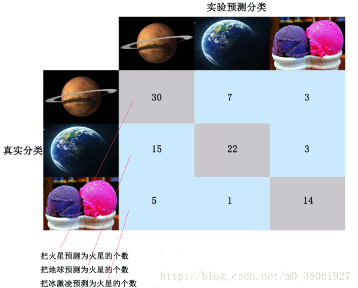
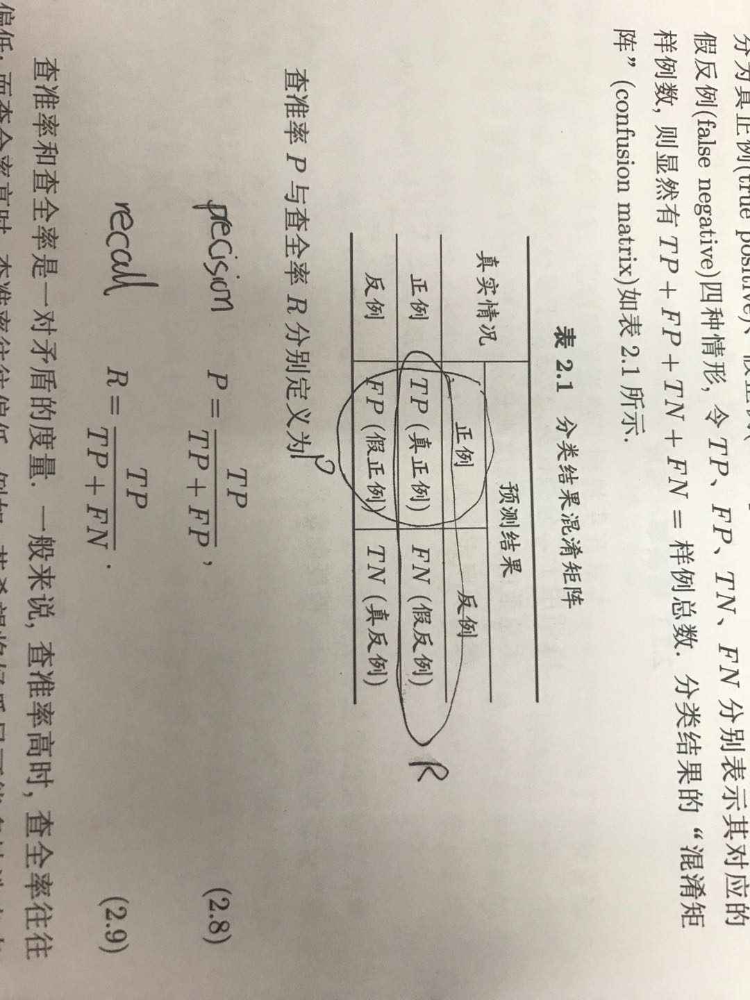

# 前言
《Web安全深度学习实战》的读书笔记，源码和数据均来自兜哥的[Git](https://github.com/duoergun0729/2book)，代码可能根据报错进行微调，然后加了一些注释。

运行环境:
    ```
    MAC 10.13.3 
    Python 3.6.4 Anaconda
    ```
# 数据预处理

[TF-IDF](http://www.ruanyifeng.com/blog/2013/03/tf-idf.html)

[余弦相似性](http://www.ruanyifeng.com/blog/2013/03/cosine_similarity.html)

[TF-IDF、词袋模型与特征工程](https://segmentfault.com/a/1190000011480420)
+ 词袋模型:如果一个单词在文档中出现不止一次，就统计其出现的次数，词袋在词集的基础上加入了频率这个维度，使统计拥有更好的效果，通常我们在应用中都选用词袋模型。
+ TF-IDF:
    + TF意思是词频(Term Frequency):某个词在语料库中出现的次数
    + IDF意思是逆向文件频率(Inverse Document Frequency):某个词在某一类别出现的多，在其他类别出现的少，那IDF的值就会比较大
    + 因此TF-IDF其实就是TF＊IDF
+ 词袋模型与TF-IDF联合使用:用词袋模型筛选出一些高热度词汇，再用tf-idf计算其权值,详情见[BoW_tfidf.py](./forReadme/BoW_tfidf.py)

[N-gram提取特征](https://zhuanlan.zhihu.com/p/29555001)

# 模型评估
[sklearn中的模型评估-构建评估函数](https://www.cnblogs.com/harvey888/p/6964741.html)
+ sklearn中的Metric：
    ```
    - TP，True Positive 
    - FP，False Positive 
    - TN，True Negative 
    - FN，False Negative
    ```
    
    + metrics.precision_score:精确度,P = TP / (TP + FP)
    + metrics.recall_score:召回率, R = TP / (TP + FN)
    + metrics.accuracy_score:准确率,A = (TP + TN) / (TP + FP + TN + FN)
    + metrics.f1_score:F = 2*P*R/(P+R)
    + metrics.confusion_matrix:混淆矩阵
    
    
    
# 一些安装包

+ 没写的可能Anaconda已经安装好了或者我之前安装过或者可以pip一键安装

+ [xgboost 安装](https://stackoverflow.com/questions/40747738/importerror-no-module-named-xgboost)
```
git clone --recursive https://github.com/dmlc/xgboost
cd xgboost
sudo cp make/minimum.mk ./config.mk;
sudo make -j4;
sh build.sh
cd python-package
python setup.py install
```
